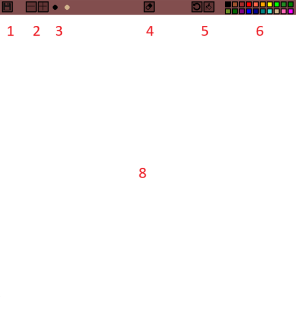

# Paint2D
## Purpose
This is an NSI (highschool CS in france) project where we have to use python and pygame to make a program.
I chose to make paint because it was the first project I made beck when i learnt the canvas API for JS.

## Usage
Here is a screenshot of the software:


1. The save icon: save your drawing to the `my_drawing.png` file.
2. The sizing buttons: increase or decrease the size of the brush.
3. The brush preview: a preview of the current color and size of the brush.
4. The eraser button: toggle the eraser, the eraser color is always white.
5. The reset button: reset the canvas the plain white.
6. The fill button: fill the canvas with the current color.
7. The color buttons: Modify the color of the brush.
8. The canvas: where you can draw.

You can load an existing image by launching the program with the name of the image ffor argument.  
Example:
```bash
python3 main.py my-image.png
```